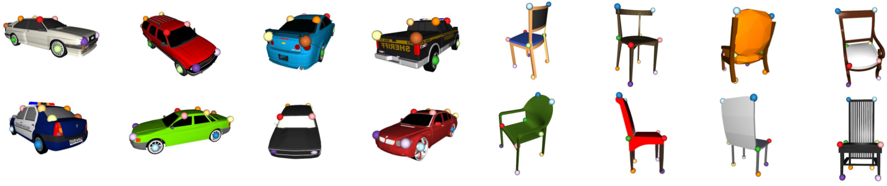

# Semi-parametric Object Synthesis

<p align="center">
  
</p>

## Abstract

In this work we introduce a new semi-parametric approach for synthesizing novel views of a vehicle starting from a single monocular image. Differently from *parametric* (i.e. entirely learning-based) methods, we show how *a-priori* geometric knowledge about the object and the 3D world can be successfully integrated into a deep learning based image generation framework. As this geometric component is not learnt, we call our approach *semi-parametric*.

In particular, we exploit man-made object symmetry and piece-wise planarity to integrate rich *a-priori* visual information into the novel viewpoint synthesis process. An Image Completion Network (ICN) is then trained to generate a realistic image starting from this geometric guidance. 

This careful blend between parametric and non-parametric components allows us to i) operate in a real-world scenario, ii) preserve high-frequency visual information such as textures, iii) handle truly arbitrary 3D roto-translations of the input and iv) perform shape transfer to completely different 3D models.

Eventually, we show that our approach can be easily extended to other rigid objects with completely different topology, even in presence of concave structures and holes (e.g. chairs). A comprehensive experimental analysis against state-of-the-art competitors shows the efficacy of our method both from a quantitative and a perceptive point of view.

## Paper

<p align="center">
 <table>
  <tr>
  <td align="center"><a href="https://arxiv.org/abs/1907.10634" target="_blank"></a></td>
  </tr>
  <tr>
  <td><pre>  
@article{palazzi2019semi,
  title={Semi-parametric Object Synthesis},
  author={Palazzi, Andrea and Bergamini, Luca and Calderara, Simone and Cucchiara, Rita},
  journal={arXiv preprint arXiv:1907.10634},
  year={2019}
}
</pre></td>
  </tr>
</table> 
</p>


## Code

### Install

Run the following in a fresh Python 3.6 environment to install all dependencies:

```bash
pip install -r requirements.txt
```

Code was tested on Ubuntu linux only (16.04, 17.04).

### How to run

To run the demo code, please download and unzip all the data from [this shared directory](https://drive.google.com/open?id=1ZEDvmKjcEHsPTtQX9GQ8GWecKqfSZsGw) in a `<data_root>` of your choice.

The entry point is [`run_rotate.py`](https://github.com/iccv19sub265/semiparametric/blob/master/run_rotate.py). The script expects as mandatory arguments the object class, pascal dataset, pre-trained weights and 3D models dir.

For the *car* class it can be run as follows:
```bash
python run_rotate.py car <data_root>/pascal_car <data_root>/car_icn.pth <data_root>/car_cads --device cpu
```
replace *chair* with *car* to run on the chair class.

### Description and usage

If everything went well,, you should see a GUI like the following:

<p align="center">
  
</p>

The GUI is composed of two windows: the *viewport* and the *output* one.

While the focus is on the *viewport*, keyboard can be used to move around the object in spherical coordinates. [Here](https://github.com/iccv19sub265/semiparametric/blob/master/help.txt) the full list of commands is provided. While you move, the *output* shows both Image Completion Network (ICN) inputs (2.5D sketches, appearance prior) and network prediction. Please refer to Sec.3 of the paper for details.

*Notice*: it may happen that when starting the program, open3D does not render anything. This is an initialization issue. In case this happens, just focus on the *viewport* and press spacebar a couple of times until you see both windows rendered properly.

## Supplementary animations

### Results for *chair* class

<p align="center">
  
</p>

### Extreme viewpoint transformations (see Sec. 4)

**Due to its *semi-parametric* nature, our method can handle extreme viewpoint changes.**

Manipulating radius        |  Manipulation elevation   | Arbitrary rototranslation
:-------------------------:|:-------------------------:|:-------------------------:
     |     |  

Chairs backflip                      |
:-----------------------------------:|
  |

---

## Datasets ([link](https://drive.google.com/open?id=1Dd6Gas3PF9hJoSa_1mkk64mA8fV4vNoK) for download)

<p align="center">
  
</p>

**We release two datasets of 3D models (*cars*, *chairs*) with annotated 3D keypoints.**

#### Dataset structure
Currently, there are 59 annotated models for car and 73 for chair.

3D models come from [ShapeNet](https://www.shapenet.org/) and have been converted in `.ply` format (with colors).

Each example of the datasets is composed of the following components:
* One `.ply` file containing the 3D model mesh and colors.
* One `.yaml` file containing the 3D keypoints annotation
* One `.jpg` image of the model thumbnail.

#### Annotation
Annotated keypoints are the ones in [Pascal3D+](http://cvgl.stanford.edu/projects/pascal3d.html): 12 for cars and 10 for chairs.

Car keypoints: *front wheel*, *back wheel*, *upper windshield*, *upper rearwindow*, *front light*, *back trunk* (2x, left and right).

Chair keypoints: *back upper*, *seat upper*, *seat lower*, *leg upper*, *leg lower* (2x, left and right).

#### Terms of use

We believe that research should be as open as possible and we are happy if these datasets can be helpful for your research too. If you use these data, please cite [our research work](https://github.com/ndrplz/semiparametric#paper).

Since 3D models come from ShapeNet database, if you use this dataset you agree to ShapeNet [terms of use](https://www.shapenet.org/terms).

